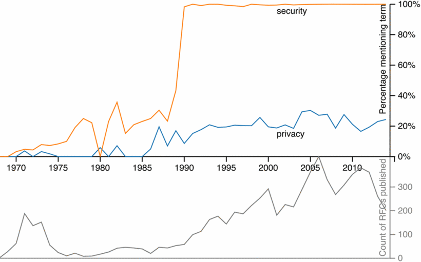
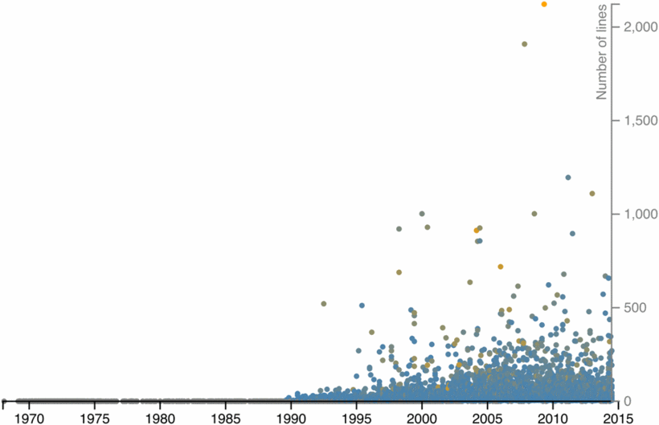

% Reviewing for Privacy ([Nick Doty](http://npdoty.name))
% [iGor milhit](https://igor.milhit.ch) - [sources](https://github.com/iGormilhit/seminaire-web)
% 10 novembre 2015

# Introduction

## Référence

DOTY, Nick, 2015. Reviewing for Privacy in Internet and Web
Standard-Setting. In : *2015 IEEE Security and Privacy Workshops (SPW)*
\[en ligne\]. mai 2015. pp. 185‑192. Disponible à l’adresse :
[http://dx.doi.org/10.1109/SPW.2015.18](http://dx.doi.org/10.1109/SPW.2015.18)

## Structure

```
├── I. Introduction
├── II. Method
│   ├── A. Data Sources
│   └── B. Scope
├── III. History of Privacy and Security Reviews
│   ├── A. IETF
│   └── B. W3C
├── IV. Reactions to Snowden
├── V. Trends
│   ├── A. Systematization 
│   ├── B. Integrating Privacy and Security 
│   └── C. Leadership 
└── VI. Future Work 
```


## Nick Doty

* [npdoty.name](http://npdoty.name)
* Bachelor en philosophie
* Master en *Information management system*
* PhD en *Information science*
* *privacy analyst* pour le W3C ([PING](http://www.w3.org/Privacy/) - DNT)

## *Privacy*

* protection contre l'immixion, cf. [art. 12](http://www.un.org/fr/documents/udhr/#a12)
* contrôle par l'utilisateur
* *essentially-contested concept* [[wp](https://en.wikipedia.org/wiki/Essentially_contested_concept) | [wpfr](https://fr.wikipedia.org/wiki/Concept_essentiellement_contest%C3%A9)]
* **~~unique~~** définition de la *privacy*
* pourtant ...

## Sécurité

* comprend la *privacy*
* complexe
* transversal

## *Reviewing for...*

* *peer review*
* évaluation

## Standards Internet et Web

* déterminent les fonctionnalités
* → nos usages, notre sécurité, notre *intimité* en ligne

## IETF et W3C

* organisations principales constituant ces standards
* ~~les seules~~ : [WHATWG](https://whatwg.org/), [OASIS](https://www.oasis-open.org/), etc.
* leurs méthodes et modes de fonctionnement déterminent
* nos usages, notre sécurité, notre *intimité* en ligne

## Organisations particulières

* volontariat
* consensus

# Buts de l'étude

## Hypothèse

* ∅

## Alors ?

* Comprendre le fonctionnement des organisations
* Évaluer l'histoire des thèmes *privacy* et sécurité à IETF et W3C
* l'impact et les réactions aux **révélations Snowden**
* les tendances du point de vue des méthode d'évaluation de ces thèmes

# Méthode

## Analyse textuelle

* **automatique** et manuelle
* RFCs, TRs, *mailing lists*
* Actualités de médias de masse, rapports, standards en réaction à Snowden (*timeline*)
* Entretiens semi-structurés

## RFC

* historique complet depuis 1969
* *privacy* : notion transversale comme a11y, i18n, *sécurité*
* standards par *couches* → déterminismes des couches de bases
* méthode : *parsing* du *plain-text*, repérage des sections, nbre de ligne, longueur section sécurité ou *privacy* / rapport longueur RFC

## TR

* historique plus récent, 1996
* analyse le % de TRs mentionnant au moins 1x le terme

# Résultats et conclusions

##



## Historique des RFC

* [RFC 1543](http://tools.ietf.org/html/rfc1543), 1993, *Instructions for RFC authors*

> All RFCs are required to have a Security considerations section. Historically, such sections have been relatively weak ([RFC 3552](http://tools.ietf.org/html/rfc3552))

## Historique des RFC

* 1996, une RFC signale que les sections sont trop courtes
* *sécurité* quasi absentes avant 90s, existantes mais brèves ensuite
* dès 2000, les sections sont plus grandes, tout de même minimalistes (cf. figure 2)
* longueur != qualité

##



## Historique des RFC

* Introduction d'un modèle, avec une section *Security Considerations*
* Outil de validation
* Sections évaluées par le *Security Directorate*

## Historique des RFC

> Now everyone [thinks about security]. Not everyone does, but as soon as you don't, you get called out. (entretiens semi-structurés)

* RFCs évaluées par *Area Directors*, *Security Area Directors* et IESG
* peuvent être rejetées, sujettes à révision
* évaluation pointilleuses
* approbation difficile à obtenir

## Sécurité → *privacy*

* juillet 2013, [RFC 6973](http://tools.ietf.org/html/rfc6973) : *Privacy Considerations for Internet Protocols*
* demande de faire la liste des menaces
* description des mesures de réduction des risques
* propose *checklist* pour identifier et résoudre les problèmes

## Sécurité → *privacy*

* Existe des RFCs spécifiques à la notion de *privacy*
* [``geopriv`` Working Group](http://www.ietf.org/wg/concluded/geopriv.html)
* modèle de communication des données de localisation
* exigence d'une politique claire d'utilisation des données
* contrôle par l'utilisateur

## La *privacy* dans les standards du W3C

* les TRs sont publics → analysables
* pas d'exigence spécifiques comme à l'IETF
* un nombre de TRs mentionnant les termes plus stables
* relativement nombreux (~ 20 %)

##


## La *privacy* dans les standards du W3C

* au W3C, des efforts significatifs sur le thème
* existent des standards qui s'en occupent spécifiquement

## P3P

* [*Platform for Privacy Preferences Projet*](http://www.w3.org/P3P/)
* Projet terminé, a eu peu de succès
* but : améliorer prise de conscience des pratiques des sites Web
* descriptions des politiques des sites Web dans des fichiers *machine readable*
* utilisation d'un langage XML
* volonté de permettre une grande souplesse d'implémentation
* donner le contrôle à l'utilisateur

## DNT

* [*Do Not Track*](http://www.w3.org/TR/tracking-dnt/)
* offir le choix à l'utilisateur
* 2010 : pris en charge par *Federal Trade Commission*
* 2011 : implémentation dans les navigateurs
* préférence du navigateur → respectée par le site Web
* très souple
* *Privacy Badger* de l'EFF

## Évaluation de la *privacy* au W3C

* le thème apparaît dans les spécifications de plusieurs APIs
* pas d'exigence de section dans les documents publiés...
* ... mais dans les procédures d'évaluations
* charte des WG
* directeur du W3C

## Évalutation par le PING

* de manière informelle, apporte son expertise
* PING est composé de volontaires : académiques, société civile, industrie, etc.
* travaille sur les procédures pour améliorer les processus d'évaluation
* *Technical Architecture Group*, *Web Application Working Group*, *Web Security Interest Group*

## Amélioration du processus

* autres notions transversales : a11y, i18n...
* groupes spécifiques : *Internationalization Working Group*, *Web Accessibility Initiative*
* travaillent sur les procédures

# Réaction aux révélations Snowden

## Révélations Snowden

* juin 2013, articles de Greenwald
* section 215, collection des métadonnées téléphoniques
* accès ``Prism`` aux serveurs des grandes compagnies technologiques
* programmes ``XKeyscore`` et ``Bullrun`` (chiffrement)
* insertion de vulnérabilité dans le développement de standards de chiffrement au NIST

## Types de réactions

* très nombreuses, article ne propose qu'un résumé (*privacy* et sécurité)
* déclarations individuelles / d'organisations
* formations de nouveaux groupes de travail et de nouvelles collaborations
* réponses directes sous forme de standards et de code

## Réaction émotionnelle

* Un document de 7 pages, [*A Simple Statement*](https://tools.ietf.org/id/draft-thomson-perpass-statement-00.txt) :

> we had a good thing   
> you messed it up   
> for everyone   
> we trusted you   
> we were naive   
> never again   

## IETF, novembre 2013

> Pervasive surveillance is an attack, and the IETF needs to adjust our thread model to consider it when developing standards track specification.

* pour ou contre ?
* fort consensus
* confirmé dans des documents plus rigoureux
* [RFC 7258](http://tools.ietf.org/html/rfc7258) : obligation d'aborder la menace d'une suveillance massive dans tous les protocles existants ou nouveaux

## IETF *meeting* à Berlin

* en même temps que la publication de ``XKeyscore``
* création d'un groupe informel via la *mailing list* ``perpass``
* *BoF* (*Birds of a Feather*) : mise en place d'une activité plus formelle
* un *workshop* par l'IAB et le W3C : renforcement d'Internet contre la surveillance massive

##


## La liste ``perpass``

* *brainstorming*
* étudie une proposition pour augmenter l'utilisation du chiffrement
* possibilité d'un nouveau WG pour des standards sur la sécurité
* discussions sur un nouveau modèle de menace et les réponses possibles
* discussions sur les procédures pour évaluer la *privacy*

## Chiffrement

* réponse la plus concrête : retrounement en faveur
* les entreprises se mettent à chiffrer leurs communications internes
* Google et les transferts entre *datacenters* VS ``muscular``
* faire en sorte que la navigation soit chiffrée
* déclaration de l'IAB pour encourager le chiffrement à tous les niveaux
* → *no new cleartext*
* ...

## Web APIs

* sont concernées
* volonté de restreindre les fonctionnalité des navigateurs si connexion non-sécurisée
* ex: infos de localisations, la caméra, les divers sensors du *smartphone*
* volonté de mieux sécuriser les connexions
* de motiver les développeurs à déployer des connexions plus sûres

# Tendances

## Systématisation

* s'inspirer du domaine de la sécurité (amélioration de l'évaluation)
* IAB introduit une RFC sur la *privacy* via des tutoriels
* au W3C, élaboration de *checklists*
* exemple du *fingerprinting*
* procédures, ex : *Privacy Specification Assessment*

## Systématisation et décentralisation

* plus de succès pour le PING
* que pour établir des procédures formelles
* le *Privacy Directorate* de IETF a été abandonné

## Intégration

* passe d'une évaluation sur demande, par groupes particuliers
* à une évaluation globale, comprenant la sécurité et la *privacy*
* ces notions dépendent souvent des couches inférieures
* → identification des problèmes similiaires d'une spécification à l'autre
* W3C : deux groupes spécifiques
* IAB fusionne les deux groupes : confidentialité, résilience, confiance

## *Leadership*

* [Tao of IETF](https://www.ietf.org/tao.html) :

> We reject kings, presidents and voting. We believe in rough consensus and running code.

## *Leadership*

* joue un rôle important
* les entretiens mettent en évidence des autorités reconnues :
* *Area Directors*, IESG
* IETF, W3C sont des organisations avec un *leadership* certain
* dont les réactions aux révélation Snowden ont été importantes

## *Leadership*

* pourtant des oppositions à la notion de *leadership*
* les vendeurs de *middleboxes* (proxies, cache, FAI, etc.) VS chiffrement
* difficulté d'obtenir un consensus, besoin d'une large implémentation

# Travail futur

## Mieux comprendre

* mieux comprendre le fonctionnement des organisations
* mieux comprendre la mise en application dans les standards
* curcial pour faire face aux attaques gouvernementales contre la sécurité

## Étudier les pratiques

* approche multi-modale
* qualitatives : entretien semi-structuré
* analyses textuelles automatiques et manuelles
* notes d'observation sur le terrain (ethnographie)

## Défi et élargissement

* volontariat, consensus et absence de hiérarchie
* défi pour l'implémentation de standards pour la *privacy* et la sécurité
* connaissance utile pour d'autres domaines :
* logiciels libres, institutions de la gourvernances d'Internet, etc.

# Importance des résultats

## Amélioration du savoir

* comprendre comment les standards sont élaborés
* meilleure connaissance des organisations complexes
* mise en évidence d'un processus itératif et réflexif
* capacité de réagir à l'environnment (nécessité)
* pro-activité ?

# Critique

## Un peu plus de données

* utilisation des données quantitatives pas suffisantes
* idem avec les données qualitatives
* meilleure mise en évidence des aticles tout public
* certainement très utile pour les participants

# Merci
